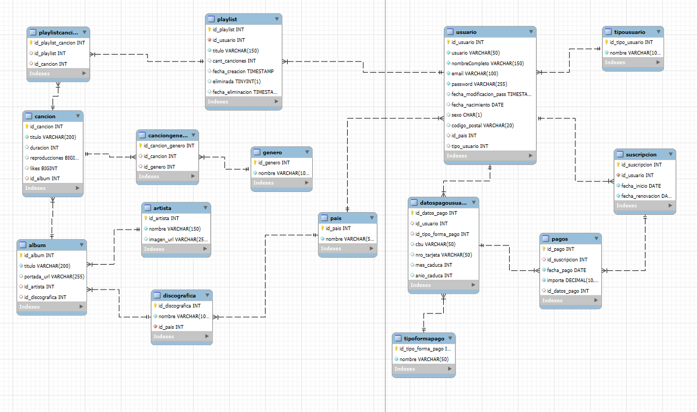

# 🎵 Spotify Backend API - Proyecto Integrador

[](https://nodejs.org/)
[](https://expressjs.com/)
[](https://mysql.com/)
[](https://sequelize.org/)
[](https://swagger.io/)

Una **API REST completa** que simula el backend de una plataforma de streaming musical como Spotify. Desarrollada con **Node.js, Express y MySQL**, implementa un modelo relacional robusto con validaciones avanzadas y consultas complejas.

## 🚀 Demo en Vivo

```bash
# Clonar el repositorio
git clone https://github.com/Ragepay/Trabajo-Integrador-Spotify-Backend.git

# Instalar dependencias
cd Trabajo-Integrador-Spotify-Backend
pnpm i

# Configurar base de datos
mysql -u root -p < script.sql

# Configurar variables de entorno
cp .env.example .env
# Editar .env con tus credenciales de MySQL

# Iniciar servidor
npm run dev
```

🌐 **API disponible en:** `http://localhost:9000/api/v1`  
📚 **Documentación Swagger:** `http://localhost:9000/api-docs`

---

## ✨ Características Principales

### 🎯 **Funcionalidades Core**
- **Gestión completa de usuarios** con autenticación y roles
- **Catálogo musical** (artistas, álbumes, canciones, géneros)
- **Sistema de playlists** con soft-delete
- **Suscripciones y pagos** con múltiples métodos
- **Análisis de datos** con vistas complejas y JOINs

### 🔧 **Tecnologías Utilizadas**
- **Backend:** Node.js + Express.js
- **Base de Datos:** MySQL 8.x
- **ORM:** Sequelize con migraciones
- **Documentación:** Swagger/OpenAPI 3.0
- **Seguridad:** bcrypt para hash de contraseñas
- **Validaciones:** Middleware personalizado
- **Testing:** Archivo api.http con casos completos

### 🏗️ **Arquitectura**
- **Patrón MVC** (Modelo-Vista-Controlador)
- **Separación de responsabilidades** clara
- **Middleware** para manejo de errores
- **Rutas modularizadas** por entidad
- **Modelos relacionales** con Sequelize

---

## 📊 Modelo de Datos



### 🗄️ **Entidades Principales**
- **Usuario** - Gestión de cuentas y perfiles
- **Artista** - Información de artistas musicales
- **Álbum** - Colecciones musicales
- **Canción** - Tracks individuales con metadatos
- **Playlist** - Listas personalizadas de usuarios
- **Suscripción** - Planes de pago (Free, Standard, Premium)
- **Pago** - Historial de transacciones

### 🔗 **Relaciones Complejas**
- **Muchos a Muchos:** Canciones ↔ Géneros, Playlists ↔ Canciones
- **Uno a Muchos:** Artista → Álbumes → Canciones
- **Soft Delete:** Playlists con eliminación lógica
- **Constraints:** Validaciones de integridad y unicidad

---

## 🌐 API Endpoints

### 👥 **Usuarios**
```http
GET    /api/v1/usuarios                    # Listar usuarios (paginado)
GET    /api/v1/usuarios/:id               # Obtener usuario específico
POST   /api/v1/usuarios                   # Crear nuevo usuario
PUT    /api/v1/usuarios/:id               # Actualizar usuario
DELETE /api/v1/usuarios/:id               # Eliminación lógica
GET    /api/v1/usuarios/password-vencidas # Usuarios con contraseña vencida
```

### 🎵 **Catálogo Musical**
```http
# Artistas
GET    /api/v1/artistas                   # Listar artistas
POST   /api/v1/artistas                   # Crear artista

# Álbumes
GET    /api/v1/albumes                    # Listar álbumes (filtros disponibles)
GET    /api/v1/albumes/:id               # Obtener álbum específico
GET    /api/v1/albumes/:id/canciones     # Canciones de un álbum
POST   /api/v1/albumes                   # Crear álbum

# Canciones
GET    /api/v1/canciones                 # Listar canciones (múltiples filtros)
GET    /api/v1/canciones/:id             # Obtener canción con detalles
POST   /api/v1/canciones                 # Crear canción
PUT    /api/v1/canciones/:id             # Actualizar canción
POST   /api/v1/canciones/:id/generos     # Asociar género a canción
DELETE /api/v1/canciones/:id/generos/:idGenero # Desasociar género

# Géneros
GET    /api/v1/generos                   # Listar todos los géneros
```

### 🎧 **Playlists**
```http
GET    /api/v1/playlists                 # Listar playlists (filtro por usuario)
GET    /api/v1/playlists/:id             # Obtener playlist específica
POST   /api/v1/playlists                 # Crear nueva playlist
PUT    /api/v1/playlists/:id             # Actualizar playlist (título/estado)
POST   /api/v1/playlists/:id/canciones   # Agregar canción a playlist
DELETE /api/v1/playlists/:id/canciones/:idCancion # Quitar canción
```

### 💳 **Suscripciones y Pagos**
```http
# Suscripciones
GET    /api/v1/suscripciones             # Listar suscripciones
GET    /api/v1/suscripciones/:id         # Obtener suscripción específica
POST   /api/v1/suscripciones             # Crear suscripción

# Métodos de Pago
GET    /api/v1/metodos-pago              # Listar métodos (filtro por usuario)
POST   /api/v1/metodos-pago              # Agregar método de pago

# Pagos
GET    /api/v1/pagos                     # Historial de pagos (filtros disponibles)
POST   /api/v1/pagos                     # Registrar nuevo pago
```

### ⭐ **Vistas Analíticas (JOINs Complejos)**
```http
GET /api/v1/vistas/canciones-populares-por-pais
# Análisis de canciones más reproducidas por país de usuarios

GET /api/v1/vistas/ingresos-por-artista-discografica  
# Análisis financiero por artista y discográfica con estadísticas
```

---

## 🛡️ Validaciones y Seguridad

### ✅ **Validaciones Implementadas**
- **Email único** en usuarios
- **Contraseñas hasheadas** con bcrypt
- **Duración de canciones** en segundos (INT)
- **Unicidad** en álbumes por artista
- **Fechas válidas** en suscripciones
- **Soft delete coherente** en playlists
- **Tarjetas enmascaradas** sin CVC

### 🔒 **Manejo de Errores**
- **400:** Datos inválidos o faltantes
- **404:** Recursos no encontrados
- **409:** Conflictos de unicidad
- **500:** Errores internos del servidor

Respuestas estructuradas:
```json
{
  "error": "Descripción específica del error",
  "details": "Información adicional cuando aplica"
}
```

---

## 📚 Documentación

### 🔍 **Swagger/OpenAPI**
Documentación interactiva completa disponible en `/api-docs`:
- **Todos los endpoints** documentados
- **Esquemas de request/response** detallados
- **Ejemplos de uso** para cada endpoint
- **Códigos de error** específicos
- **Casos de prueba** integrados

### 📋 **Casos de Prueba**
El archivo `api.http` incluye:
- ✅ **Casos positivos** - Flujos exitosos
- ❌ **Casos negativos** - Validación de errores
- 🔄 **Casos complejos** - Vistas con JOINs
- 📊 **Datos de prueba** - Escenarios realistas

---

## 🗂️ Estructura del Proyecto

```
📁 Trabajo-Integrador-Spotify-Backend/
├── 📄 package.json              # Dependencias y scripts
├── 📄 .env.example             # Variables de entorno template
├── 📄 script.sql               # Base de datos completa con datos
├── 📄 api.http                 # Casos de prueba REST Client
├── 📄 index.js                 # Punto de entrada
│
├── 📁 src/
│   ├── 📁 config/
│   │   └── 📄 database.js      # Configuración MySQL/Sequelize
│   │
│   ├── 📁 models/              # Modelos de Sequelize
│   │   ├── 📄 Usuario.js       # Modelo de usuarios
│   │   ├── 📄 Artista.js       # Modelo de artistas
│   │   ├── 📄 Album.js         # Modelo de álbumes
│   │   ├── 📄 Cancion.js       # Modelo de canciones
│   │   ├── 📄 Playlist.js      # Modelo de playlists
│   │   └── 📄 ...              # Otros modelos
│   │
│   ├── 📁 controllers/         # Lógica de negocio
│   │   ├── 📄 usuariosController.js
│   │   ├── 📄 cancionesController.js
│   │   ├── 📄 vistasController.js    # Vistas complejas
│   │   └── 📄 ...
│   │
│   ├── 📁 routes/              # Definición de rutas
│   │   ├── 📄 indexApi.js      # Router principal
│   │   ├── 📄 usuarios.js      # Rutas de usuarios
│   │   ├── 📄 vistas.js        # Rutas de vistas analíticas
│   │   └── 📄 ...
│   │
│   ├── 📁 middlewares/         # Middleware personalizado
│   │   ├── 📄 errorHandler.mid.js  # Manejo de errores
│   │   └── 📄 pathHandler.mid.js   # Manejo de rutas
│   │
│   ├── 📁 utils/               # Utilidades
│   │   └── 📄 hash.js          # Funciones de hash
│   │
│   ├── 📁 docs/                # Documentación
│   │   ├── 📄 swagger.yaml     # Documentación OpenAPI
│   │   └── 📄 DER-Spotify.PNG  # Diagrama Entidad-Relación
│   │
│   └── 📁 data/                # Datos de referencia
│       └── 📄 Datos_Spotify.json
```

---

## ⚡ Instalación y Configuración

### 📋 **Prerrequisitos**
- **Node.js** 18.x o superior
- **MySQL** 8.x o superior
- **Git** para clonar el repositorio

### 🛠️ **Instalación Paso a Paso**

#### 1. **Clonar el Repositorio**
```bash
git clone https://github.com/Ragepay/Trabajo-Integrador-Spotify-Backend.git
cd Trabajo-Integrador-Spotify-Backend
```

#### 2. **Instalar Dependencias**
```bash
npm install
```

#### 3. **Configurar Base de Datos**
```bash
# Crear base de datos y tablas
mysql -u root -p < script.sql

# O usando MySQL Workbench, ejecutar el contenido de script.sql
```

#### 4. **Configurar Variables de Entorno**
```bash
# Copiar archivo de ejemplo
cp .env.example .env

# Editar .env con tus credenciales
nano .env
```

Configurar en `.env`:
```env
# Configuración del servidor
SECRET_KEY=tu_clave_secreta
PORT=9000
NODE_ENV=development

# Configuración de la base de datos
DB_USER=tu_usuario_mysql
DB_PASSWORD=tu_password_mysql
DB_NAME=spotify
DB_HOST=localhost
DB_PORT=3306
```

#### 5. **Iniciar la Aplicación**
```bash
# Modo desarrollo (con nodemon)
npm run dev

# Modo producción
npm start
```

### ✅ **Verificar Instalación**
- **API:** http://localhost:9000/api/v1
- **Documentación:** http://localhost:9000/api-docs
- **Health Check:** http://localhost:9000/api/v1/usuarios (debe retornar lista de usuarios)

---

## 🧪 Testing y Pruebas

### 📊 **Datos de Prueba Incluidos**
El script SQL incluye datos completos para testing:
- **19 usuarios** de diferentes países y tipos
- **15+ artistas** reconocidos internacionalmente
- **30+ álbumes** de diversos géneros
- **100+ canciones** con metadatos completos
- **10+ playlists** (activas y eliminadas)
- **Suscripciones y pagos** para análisis

### 🔬 **Casos de Prueba**
Archivo `api.http` con casos completos:

```http
### Crear usuario exitoso
POST http://localhost:9000/api/v1/usuarios
Content-Type: application/json

{
  "usuario": "testuser",
  "nombreCompleto": "Usuario de Prueba",
  "email": "test@example.com",
  "password": "password123"
}

### Obtener canciones populares por país
GET http://localhost:9000/api/v1/vistas/canciones-populares-por-pais

### Crear playlist y agregar canciones
POST http://localhost:9000/api/v1/playlists
Content-Type: application/json

{
  "id_usuario": 1,
  "titulo": "Mi Playlist de Prueba"
}
```

### 🎯 **Escenarios de Prueba**
- ✅ **CRUD completo** para todas las entidades
- ✅ **Validaciones** de datos inválidos
- ✅ **Relaciones** entre entidades
- ✅ **Soft delete** en playlists
- ✅ **Consultas complejas** con JOINs
- ✅ **Casos límite** y errores

---

## 🚀 Despliegue

### 🐳 **Docker (Opcional)**
```dockerfile
# Dockerfile de ejemplo
FROM node:18-alpine
WORKDIR /app
COPY package*.json ./
RUN npm ci --only=production
COPY . .
EXPOSE 9000
CMD ["npm", "start"]
```

### ☁️ **Producción**
Para despliegue en producción:

1. **Variables de entorno:**
```env
NODE_ENV=production
PORT=80
DB_HOST=tu_servidor_mysql
# Otras configuraciones de producción
```

2. **Consideraciones de seguridad:**
- Configurar CORS apropiadamente
- Implementar rate limiting
- Usar HTTPS
- Configurar logs de producción

---

## 📈 Roadmap Futuro

### 🔮 **Próximas Funcionalidades**
- [ ] **Autenticación JWT** completa
- [ ] **Sistema de recomendaciones** basado en gustos
- [ ] **WebSockets** para actualizaciones en tiempo real
- [ ] **Cache con Redis** para mejorar performance
- [ ] **Microservicios** arquitectura escalable
- [ ] **GraphQL** como alternativa a REST
- [ ] **Testing automatizado** con Jest
- [ ] **CI/CD pipeline** con GitHub Actions

### 🎯 **Mejoras Técnicas**
- [ ] **Rate limiting** avanzado
- [ ] **Logs estructurados** con Winston
- [ ] **Monitoreo** con Prometheus/Grafana
- [ ] **Documentación** con JSDoc
- [ ] **Validaciones** con Joi/Yup
- [ ] **Paginación** optimizada

---

## 📄 Licencia

Este proyecto está bajo la **Licencia MIT** - ver el archivo [LICENSE](LICENSE) para detalles.

---

## 👨‍💻 Autor

**Desarrollado por:** [Ragepay](https://github.com/Ragepay)

### 🌟 **Redes Sociales**
- **GitHub:** [@Ragepay](https://github.com/Ragepay)
- **LinkedIn:** [Tu Perfil](https://linkedin.com/in/benjaminpeyraga)
- **Email:** benjapey99@gmail.com

---

## 🙏 Agradecimientos

- **Universidad/Institución** por el proyecto integrador
- **Profesores** por la guía y feedback
- **Comunidad Node.js** por las herramientas excepcionales
- **Spotify** por la inspiración del modelo de negocio

---

## ⭐ ¿Te gustó el proyecto?

Si este proyecto te fue útil:
- ⭐ **Dale una estrella** en GitHub
- 🍴 **Fork** para tus propios experimentos
- 📢 **Comparte** con otros desarrolladores
- 🐛 **Reporta bugs** para mejorar el código
- 💡 **Sugiere mejoras** via Issues

---

<div align="center">

### 🎵 ¡Hecho con ❤️ y mucho ☕!

**¿Listo para crear tu propia plataforma de streaming?** 🚀

[⬆️ Volver al inicio](#-spotify-backend-api---proyecto-integrador)

</div>